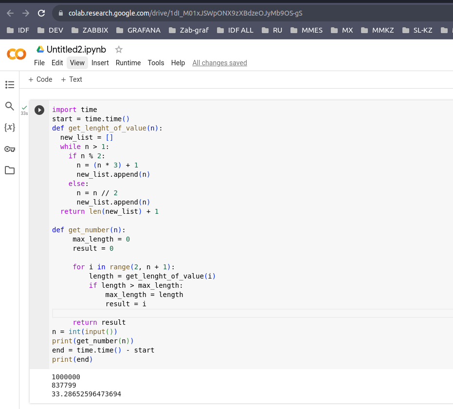

---
```sh
Обязательное домашнее задание:
Самая длинная последовательность Коллатца

Следующая итерационная последовательность определена для набора натуральных чисел:

Если n чётное n = n/2 Если n нечётное n = n*3 + 1

Используя приведенное выше правило и начиная с 13, мы генерируем следующую последовательность:

13 -> 40 -> 20 -> 10 -> 5 -> 16 -> 8 -> 4 -> 2 -> 1

Видно, что эта последовательность (начиная с 13 и заканчивая 1) содержит 10 терминов. 
Хотя это еще не доказано (задача Коллатца), считается, что все стартовые номера заканчиваются на 1.

Какое начальное число, меньшее миллиона, дает самую длинную цепочку?

ПРИМЕЧАНИЕ: Как только цепочка начинается, термины могут превышать один миллион.

СКОРОСТЬ ВЫПОЛНЕНИЯ ЗАМЕРЯЕМ В COLAB:

0 место - < 1.5s
1 место - < 3s
2 место - < 15s
3 место - < 35s
-1 место  - > 35s

Домашнее задание считаеться выполненым емли оно работает на 1_000_000 быстрее чем за 20 минут.
```
---

```sh
import time
start = time.time()
def get_lenght_of_value(n):
  new_list = []
  while n > 1:
    if n % 2:
      n = (n * 3) + 1
      new_list.append(n)
    else:
      n = n // 2
      new_list.append(n)
  return len(new_list) + 1

def get_number(n):
     max_length = 0
     result = 0

     for i in range(2, n + 1):
         length = get_lenght_of_value(i)
         if length > max_length:
             max_length = length
             result = i

     return result
n = int(input())
print(get_number(n))
end = time.time() - start
print(end)
```
---

